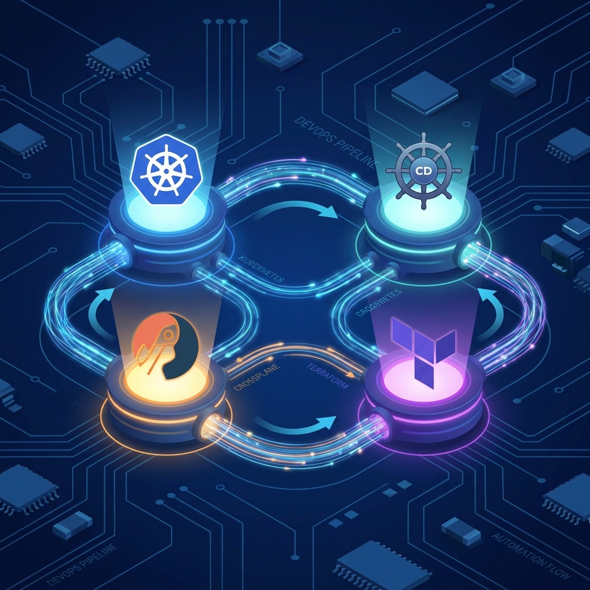

# K8s Multi-Cluster GitOps - Project Walkthrough

## 1. Project Overview
We successfully built a **GitOps-driven Multi-Cluster Platform** using:
-   **Kind**: Management Cluster.
-   **ArgoCD**: Continuous Delivery & Drift Detection.
-   **Crossplane**: Infrastructure Control Plane (managing vClusters).
-   **vCluster**: Lightweight simulated workload clusters.

## 2. Infrastructure Setup
The `bootstrap/` directory contains the Terraform (and scripts) that provisioned the initial management plane.

## 3. Configuration & APIs
We defined a custom API for creating clusters: `KubernetesCluster`.
-   **XRD**: defined the schema (node count, version).
-   **Composition**: mapped the abstract cluster to a `vCluster` Helm release.

## 4. Verification Results
### ✅ Auto-Healing Verified
Manual deletion of `dev-cluster-1` triggered immediate restoration by ArgoCD and Crossplane. "Terminator" mode confirmed.

### 🖼️ Architecture


## 5. Mission Pack: How to Enjoy the Platform 🎮
You can now "enjoy" the platform by playing the role of the **Platform Engineer**! 👷‍♂️🚀

### 1. 🏰 View Your Kingdom (ArgoCD UI)
-   Go to [https://localhost:8080](https://localhost:8080).
-   Login with the credentials from the README.
-   **Enjoy**: Seeing the beautiful green "Synced" status of your entire infrastructure.

### 2. 🧙‍♂️ Cast a Spell (GitOps Scale-Up)
-   Edit `infrastructure/claim.yaml`.
-   Change `nodeCount: 1` to `3`.
-   Commit and Push:
    ```bash
    git add infrastructure/claim.yaml
    git commit -m "Scale up cluster"
    git push
    ```
-   **Enjoy**: Watching ArgoCD automatically detect the change and upgrade your cluster without you touching `kubectl`.

### 3. 🏭 Expand the Empire (New Cluster)
-   Create a new file `infrastructure/prod-claim.yaml` (copy the dev claim).
-   Name it `prod-cluster`.
-   Commit and Push.
-   **Enjoy**: A completely new Kubernetes cluster spinning up automatically.

### 4. 🤖 Terminator Mode (Already Verified)
-   Delete the cluster manually.
-   **Enjoy**: Watching it come back from the dead immediately.

